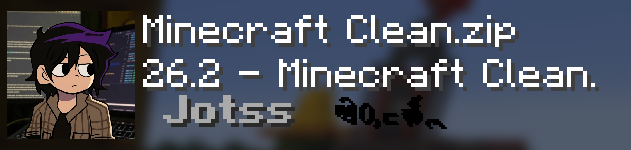
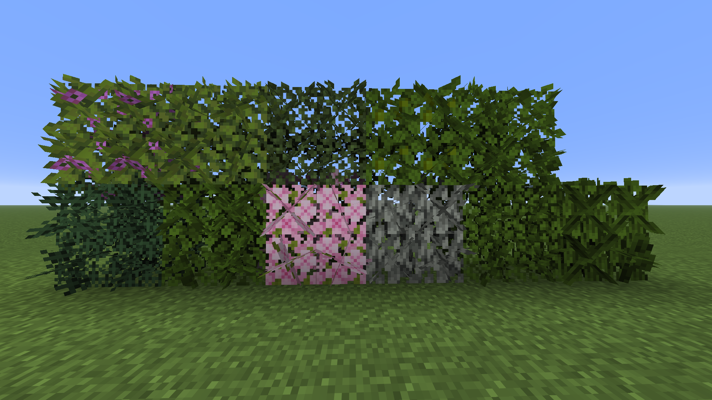
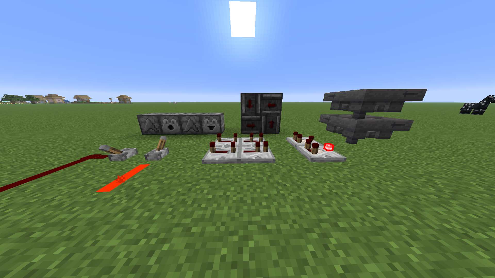
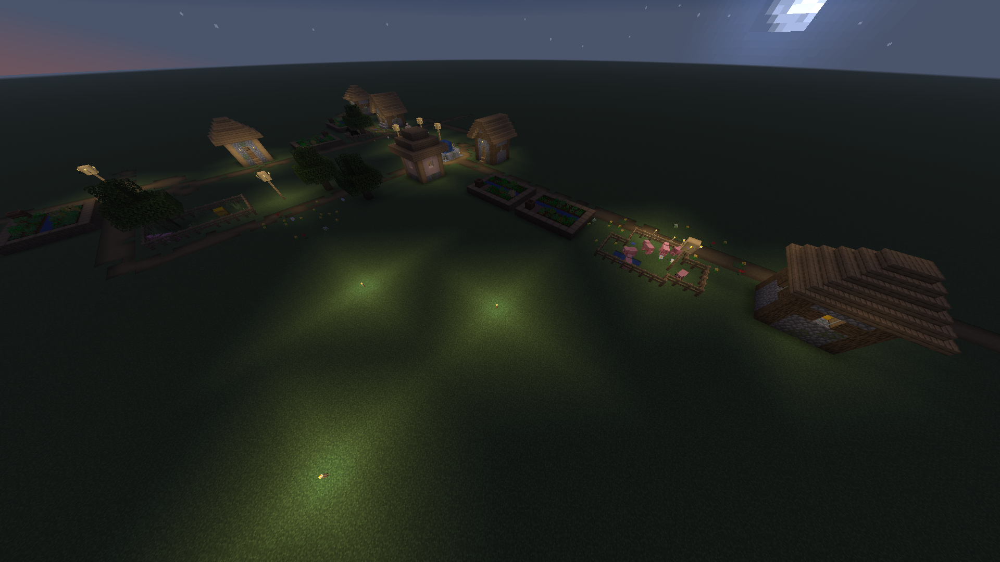
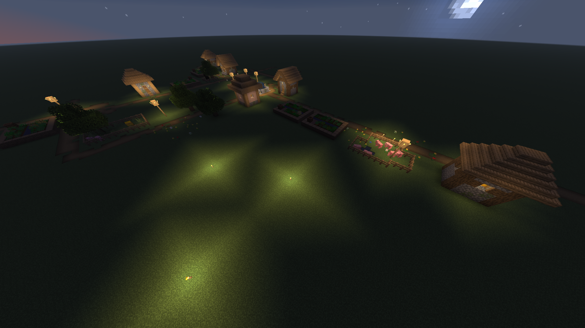
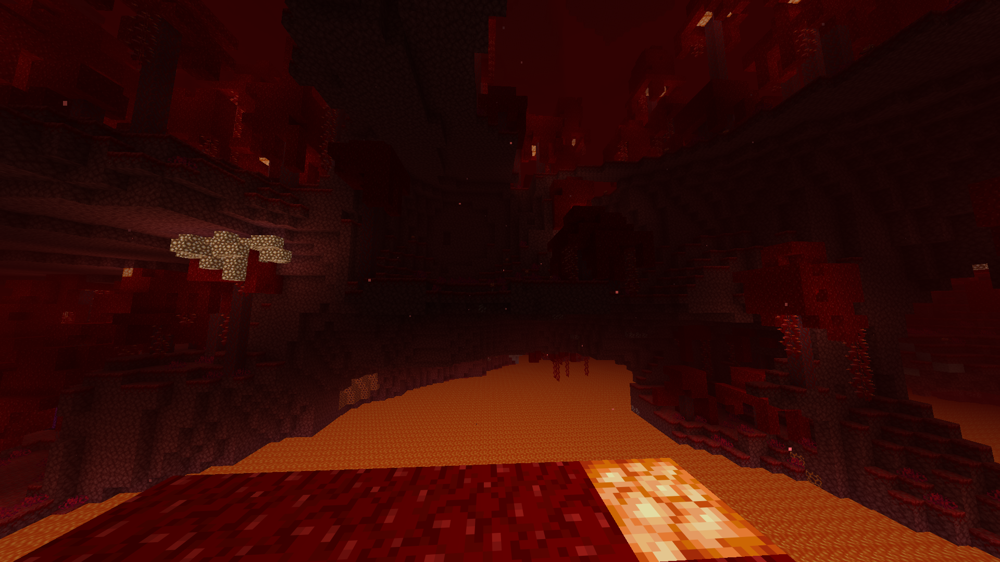
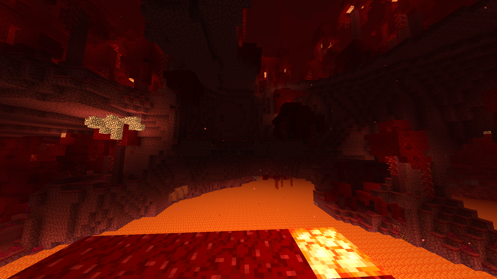

#  Minecraft Clean Texture Pack v26.2



Um texture pack moderno e limpo para Minecraft que melhora significativamente a qualidade visual do jogo com texturas refinadas e uma estética contemporânea.

---

## 📋 Sobre o Pack

- **Versão:** 26.2
- **Compatibilidade:** Minecraft 1.20+ (pack format 16-93)
- **Tipo:** Resource Pack (Texture Pack)

---

## Características Principais

### Melhorias de Texturas

O pack "Minecraft Clean" aplica uma transformação completa nas texturas do jogo:

#### 🍃 Folhagens



- **Antes:** Texturas padrão simples e planas
- **Depois:** 
  - Folhas com detalhes muito mais realistas
  - Sombreamento e profundidade melhorados
  - Variações de cores naturais para cada tipo de árvore
  - Acacia, Azalea, Birch, Cherry, Dark Oak, Jungle, Mangrove, Oak, Pale Oak e Spruce
  - Incluindo variações floridas (Flowering Azalea)

####  Blocos Funcionais



- **Dispenser & Dropper:**
  - Antes: Faces simples e básicas
  - Depois: Detalhes funcionais mais claros e visuais modernos
  
- **Hopper:**
  - Antes: Modelo plano
  - Depois: Texturas com profundidade e sombreamento realista

#### 🌐 **Shaders**

- Shaders Básico para ambientar melhor a iluminação.

Antes



Depois



#### 🌐 **Iluminação do Nether**

Antes



Depois



---

## 📁 Estrutura do Pack

```
textura-minecraft/
├── pack.mcmeta          # Metadados do pack
├── readme.MD            # Este arquivo
├── assets/
│   └── minecraft/
│       ├── blockstates/ # Estados de blocos
│       ├── models/      # Modelos 3D dos blocos
│       │   ├── block/   # Modelos de blocos
│       │   └── item/    # Modelos de itens
│       ├── items/       # Texturas de itens
│       ├── textures/    # Texturas
│       │   ├── block/
│       │   ├── entity/
│       │   ├── gui/
│       │   └── item/
│       └── shaders/     # Shaders e includes
└── github/              # Arquivos do repositório

```

---

## 💾 Instalação

### Instalação Manual

1. Copie a pasta para o diretório de resourcepacks
   
```
  C:\Users\[seuUsuario]\AppData\Roaming\.minecraft\resourcepacks

```

3. O Minecraft detectará automaticamente
4. Ative na seção de Pacotes de Recursos

---

## 🔧 Requisitos

- **Minecraft Java Edition** 1.20 ou superior
- Recomendado: GPU dedicada para melhor renderização

---

## 📝 Notas

- Este pack é um **Resource Pack**, não adiciona novos blocos ou itens
- Totalmente compatível com mods que modificam apenas mecânicas

---

## 📄 Licença

Este projeto está licenciado sob a MIT License.

---

## 📞 Suporte

email: josiephelipel265@gmail.com

---

